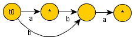
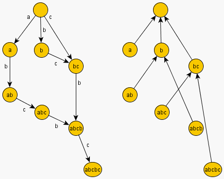

# 后缀自动机学习笔记
## 后缀自动机的定义
> 一个字符串`S`的后缀自动机是一个有向无环图，结点代表“状态”，边代表状态之间的“转移”。


> 其中一个状态（结点）记作`T0`叫做后缀自动机的“初始态”，他可以到达自动机上的其他所有状态。

> 一个或更多状态标记为“终止态”。如果我们从`T0`出发到达任何一个终止态，并记录下我们走过的边，就可以得到字符串`"S"`的一个后缀。

后缀自动机是一个可以解决大部分字符串问题的有力的数据结构。仅需20~30行代码就可以解决下列问题，而且他的时间复杂度和空间复杂度都是线性的。

1. 给定字符串的不同子串的个数
2. 不同子串的总长度
3. 字典序第k大的子串
4. 最小循环移位
5. 母串中某个模式串的出现次数
6. 所有模式串的出现位置
7. 最长公共子串
8. 多个串的最长公共子串
9. 查询不在文本中出现的最短字符串

## 后缀自动机的性质
包含了字符串所有子串的信息。从“初始态(`t0`)”出发并写下它走到任意状态的路径（不一定要到终止态），我们所得到的就是给定串的一个子串。如果我们写下所有的路径，就可以得到所有不同的子串。反过来说，字符串`"S"`的任何一个子串对应于后缀自动机上一条从“初始态”（`t0`）出发的路径。

### `endpos`
考虑字符串`"S"`的一个非空子串`"T"`，那么`endpos(T)`是所有的`"T"`在`"S"`中结束位置的集合。如果两个字符串的结束位置完全相同（即`endpos(s1)==endpos(s2)`）则我们把`s1`，`s2`称之为终止态等价。

---
考虑一个字符串`"aba"`
1. `endpos("aba")={3}`
2. `endpos("ba")={3}`
3. `endpos("a")={1,3}`
4. `endpos("ab")={2}`
5. `endpos("b")={2}`
6. `endpos("")={-1,3}`

所以子串`"aba"`和`"ba"`是等价的所以他们属于一个类，`"b"`和`"ab"`也是等价的。而`"a"`自己独立组成一个类。最后一个代表空串，我们把它的`endpos`记作`{-1,length(s)}`



这构成了构建后缀自动机的基础。概括地说，**“后缀自动机中状态的数量等于`endpos`类的数量**。在这个例子中，它等于4。

如果`u`是`w`的后缀，则有`endpos(w)⊂endpos(u)`，否则`endpos(u)∩endpos(w)=∅`。

对于一个给定的类，如果把它所有的子串按长度升序排序，**每个子串会比下一个短1个单位**。。换句话说，某一终点等价类中的字符串互为后缀，它们的长度依次取区间`[x,y]`内的所有数。

### 后缀衔接
考虑自动机中的状态`v!=(t0)`。我们知道，有一个确定的子串集合，其中元素和`v`有着相同`endpos`的集合。并且，如果我们记`w`是其中的最长者，其余子串均是`w`的后缀。我们还知道`w`的前几个后缀（按照长度降序）在同一个终点等价类中，其余后缀（至少包括空后缀）在别的等价类中。** 换言之，`v`的后缀链接`link(v)`指向在不同等价类中的w的最长后缀。**
1. `minlen(v)=len(link(v)+1)`
2. `endpos(v)⊂endpos(link(v))`

在上述例子中，令`w="aba",v={"aba","ba"}`，那么`v`的后缀衔接相当于状态`{"a"}`，我们叫它状态`r`，对`r`做同样的操作，`r`的后缀衔接会指向空串。另外，每一个结点（除了`(t0)`）如果没有符合条件的衔接都会有后缀衔接至`(t0)`。



### 小结
- `S`的所有子串可以按照它们的终点集合被分成等价类。
- 后缀自动机由一个初始状态`t0`和所有不同的终点等价类所对应的状态组成。
- 每个状态`v`对应一个或多个字符串，我们记`longest(v)`是其中最长者，`len(v)`是其长度，记`shortest(v)`是这些字符串中的最短者，其长度为`minlen(v)`。该状态对应的所有字符串是`longest(v)`的不同后缀，并且包括`[minlen(v),len(v)]`之间的所有长度。
- 对每个状态`v!=t0`定义的后缀链接指向的状态对应`longest(v)`的长度为`minlen(v)-1`的后缀。后缀链接形成一棵以`t0`为根的
树，而这棵树事实上是所有终点集合的树状包含关系。`minlen(v)=len(link(v))+1`。
- 如果我们从任意节点`v0`开始沿后缀链接移动，我们早晚会到达初始状态`t0`.在此情况下，我们得到了一系列不相交的区间`[minlen(v),len(v)]`，其并集是一个连续区间。

## 线性构造算法
下面描述这个算法。算法是在线的，即:逐个向`"S"`中加入字符，并适当地对当前的自动机进行修改。

为了达到线性空间的目的，我们将只存储每个状态的`len`，`link`的值。

最初自动机由一个状态`t0`组成，我们称之为`0`状态（其余状态将被称作1,2,...）。对此状态，令`len=0`，为方便起见，将`link`值设为`-1`（指向一个空状态）。

因此，现在的任务就变成了实现向当前字符串末尾添加一个字符`c`的操作。

具体操作如下：
1. 令`last`为对应整个字符串的状态（最初`last=0`，在每次字符添加操作后我们都会改变`last`的值）。
2. 建立一个新的状态`cur`，令`len(cur)=len(last)+1`，而`link(cur)`的值并不确定。
我们最初在`last`，如果它没有字符`c`的转移，那就添加字符`c`的转移，指向`cur`，然后走向其后缀链接，再次检查——如果没有字符`c`的转移，就添加上去。如果在某个节点已有字符`c`的转移，就停止，并且令`p`为这个状态的编号。
3. 假设我们停在了某一状态`q`，是从某一个状态`p`经字符`c`的转移而来。现在有两种情况：
    1. 如果`len(p)+1=len(q)`，那么我们简单地令`link(cur)=q`并跳出。
    2. 否则必须新建一个`q`的“拷贝”状态：建立一个新的状态`clone`，将`q`的数据拷贝给它（后缀链接，以及转移），除了`len`的值，需要令`len(clone)=len(p)+1`，`link(cur)=clone`。
4. 如果“某节点已有字符`c`的转移”这一事件从未发生，而我们来到了空状态`-1`（经由`t0`的后缀指针前来），我们简单地令`link(cur)=0`，并跳出。

## 算法实现
```cpp
struct state
{
    int len, link;
    map<char, int> next;
};

const int MAXLEN = 100000;
state st[MAXLEN * 2];
int sz, last;

void sa_init()
{
    sz = last = 0;
    st[0].len = 0;
    st[0].link = -1;
    ++sz;
}

void sa_extend(char c)
{
    int cur = sz++;
    st[cur].len = st[last].len + 1;
    int p;
    for (p = last; p != -1 && !st[p].next.count(c); p = st[p].link)
        st[p].next[c] = cur;
    if (p == -1)
        st[cur].link = 0;
    else
    {
        int q = st[p].next[c];
        if (st[p].len + 1 == st[q].len)
            st[cur].link = q;
        else
        {
            int clone = sz++;
            st[clone].len = st[p].len + 1;
            st[clone].next = st[q].next;
            st[clone].link = st[q].link;
            for (; p != -1 && st[p].next[c] == q; p = st[p].link)
                st[p].next[c] = clone;
            st[q].link = st[cur].link = clone;
        }
    }
    last = cur;
}
```